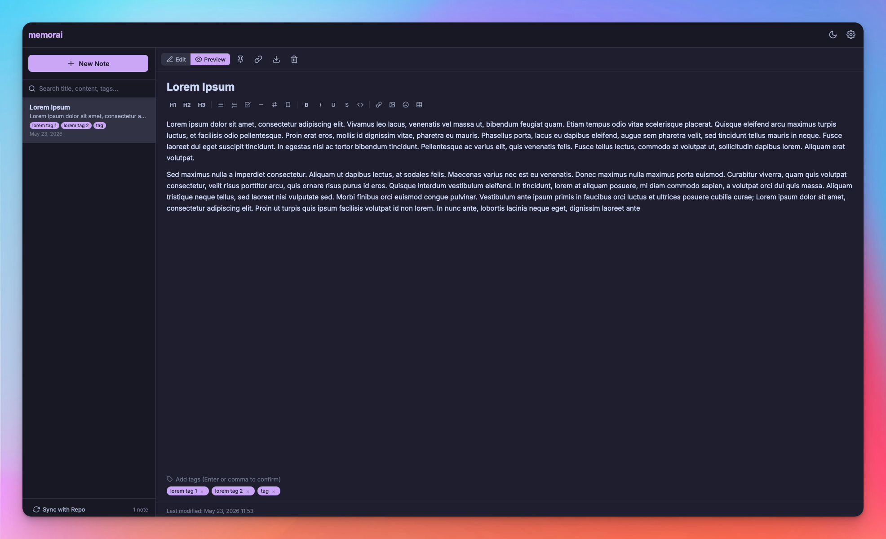

# memorai

Take notes in markdown, sync them to GitHub, and access them anywhere. A lightweight, browser-only alternative to Obsidian and Notion.

## Screenshot



## Features

- **Markdown editing** with live preview and formatting toolbar (bold, italic, headings, etc.)
- **12 themes** — Catppuccin, Nord, Tokyo Night, Dracula, One Dark, GitHub
- **GitHub Repo sync** — notes stored as `.md` files with YAML frontmatter
- **Tags** with autocomplete and inline search
- **PWA** — installable on desktop and mobile, works offline
- **Image support** — paste, drag & drop, stored in repo
- **Syntax highlighting** — code blocks support all major languages via highlight.js
- **URL hash routing** — share notes via link
- **Export** — individual notes as `.md` or full backup as JSON
- **Server config** — deploy with `config.json` for shared settings
- **147 Lucide icons** — embeddable inline via `:icon-name:` syntax
- **SEO** — Open Graph, Twitter Cards, JSON-LD, canonical URL

## Quick Start

1. Clone and serve with any static server:
   ```bash
   git clone git@github.com:mojoaar/memorai.git
   cd memorai
   python3 -m http.server 8080
   ```
2. Open `http://localhost:8080`
3. Go to Settings → enter your GitHub token and repository

> **Token permissions:** create a [fine-grained personal access token](https://github.com/settings/tokens) with **Read and write** access to **Contents** — this is required for syncing notes, images, and deletions with your repository.

4. Click "Sync with Repo" to start syncing

## Configuration

Place a `config.json` at the web root for deployment-wide settings:

```json
{
  "githubToken": "ghp_xxx",
  "repo": "owner/repo-name",
  "branch": "main",
  "url": "https://notes.example.com",
  "title": "My Notes",
  "description": "Personal knowledge base"
}
```

All fields are optional. See `config.example.json` for details.

## Tech Stack

- Vanilla JavaScript (no framework, no build step)
- CSS custom properties for theming
- GitHub Contents API for sync
- `marked` for markdown rendering
- Service Worker for offline support

## Sponsor

If you find memorai useful, consider [buying me a coffee](https://buymeacoffee.com/mojoaar).

## License

MIT — see [LICENSE](LICENSE)

---

## Changelog

### 0.1.2

- Sync now deletes remote notes removed locally (fix: orphaned `.md` files no longer left behind)
- Danger Zone in Settings — wipe all remote and local data with DELETE confirmation
- Hyperlink insertion button in formatting toolbar (`[text](url)`)
- Image and icon picker buttons moved from top toolbar to formatting toolbar
- Hide sync button and danger zone when no repository configured
- Favicon fixed for Safari/WebKit with proper link pattern (`favicon.ico` + PNGs)
- AGENTS.md added for AI-assisted development

### 0.1.1

- Removed Gist sync, replaced with GitHub Repo sync via Contents API
- Notes stored as `.md` files with YAML frontmatter — openable in any editor
- Images stored as separate files in repo instead of inline base64
- URL hash routing — share and bookmark individual notes
- Export single notes as `.md` with frontmatter
- Danger Zone: wipe all remote and local data with DELETE confirmation
- Server config via `config.json` with field locking and title/description override
- SEO: Open Graph, Twitter Cards, JSON-LD, canonical URL, `robots.txt`
- 3 new themes: Tokyo Night, Dracula, One Dark (12 total)
- Icon picker with 147 Lucide icons
- Browser favicon as inline data URI for WebKit compatibility
- Service worker with cache versioning, API filtering, and activate cleanup
- Bug fixes: XSS sanitization, localStorage error handling, auto-save sidebar update

### 0.1.0 — Initial Release

- Markdown editor with live preview and formatting toolbar
- 12 themes: Catppuccin, Nord, Tokyo Night, Dracula, One Dark, GitHub
- GitHub Repo sync via Contents API (notes as `.md`, images as files)
- Tags with autocomplete and search across title, content, and tags
- PWA support (offline cache, installable on desktop and mobile)
- Image paste, drag & drop, and upload with repo storage
- URL hash routing for sharing and bookmarking notes
- Export single notes as `.md` or full backup as JSON
- Server config via `config.json` with field locking
- 147 Lucide icons via inline embedded SVGs
- Icon picker with search
- Service worker with cache management and API filtering
- SEO: Open Graph, Twitter Cards, JSON-LD, canonical URL
